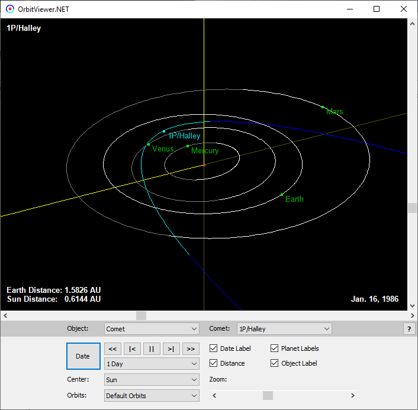

# OrbitViewer.NET

C# desktop implementation of OrbitViewer, an interactive Java applet
that displays the orbit of small bodies (comets or asteroids) in the
solar system in 3D.


## Origins

Original applet was created by Osamu Ajiki (AstroArts Inc.) in 1996.
It was further modified by Ron Baalke (NASA/JPL) in 2000-2001.


## Description

This is the initial version of OrbitViewer.NET. Most of it is just 
translated from Java to C#. The core codebase is mostly intact, 
just some C# conventions were applied, with renamings and formatting, 
and with some minor changes.


## Download

[](https://github.com/jurakovic/OrbitViewer.NET/releases/latest)

<!--
Program can be downloaded at the following URL:  
https://jurakovic.github.io/
-->


## Screenshot




## Run

Extract zip and run OrbitViewer.NET.exe.  
Program uses MPC format of orbital elements. Latest elements can be
downloaded from MPC site, link provided below in Links section.

Release package contains two sample dat files:

```
comets.dat
asteroids.dat
```


## Licence

This program is free software; you can redistribute it and/or modify
it under the terms of the GNU General Public License as published by
the Free Software Foundation; either version 2, or (at your option)
any later version.

This program is distributed in the hope that it will be useful
but WITHOUT ANY WARRANTY; without even the implied warranty of
MERCHANTABILITY or FITNESS FOR A PARTICULAR PURPOSE.  See the
GNU General Public License for more details.


## Links

Homepage  
<https://jurakovic.github.io/>

OrbitViewer Java Applet (AstroArts)  
<https://www.astroarts.co.jp/products/orbitviewer/index.html>

Center for Near Earth Object Studies - Orbits (NASA/JPL)  
<https://cneos.jpl.nasa.gov/orbits/>

Minor Planet Center: Orbital Elements (IAU)  
<https://minorplanetcenter.net/iau/Ephemerides/Soft00.html>
